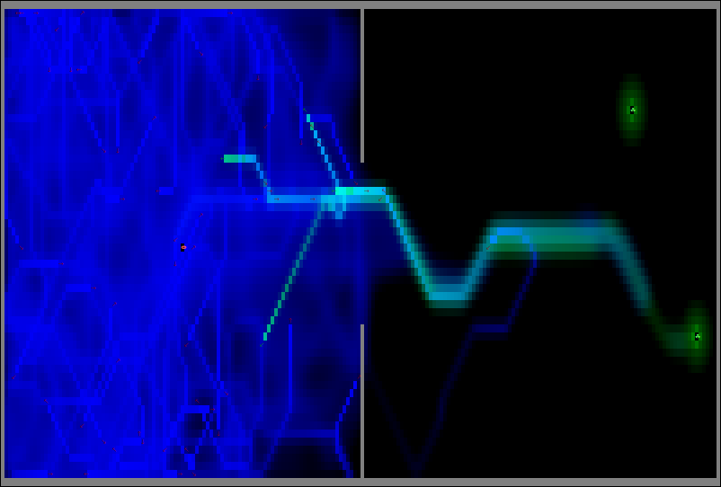
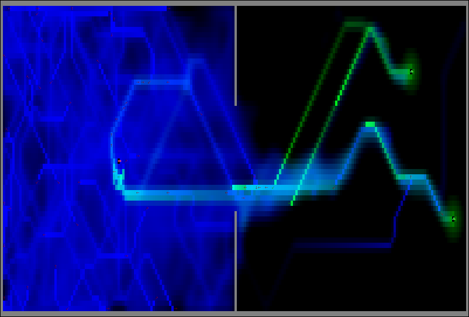

# NantArray

An array-based cellular-automata implementation of my ant pheromone simulation!

WIP

Instead of using a game engine like Pygame for the simulation, this time I've
coded things entirely using Numpy arrays!

Almost works pretty good, until I added the wall with gap as an obstruction,
so I still need to tweak the rules further, until it works more like it should.

If anyone manages to get it working better, please share, I'd love to see it!
